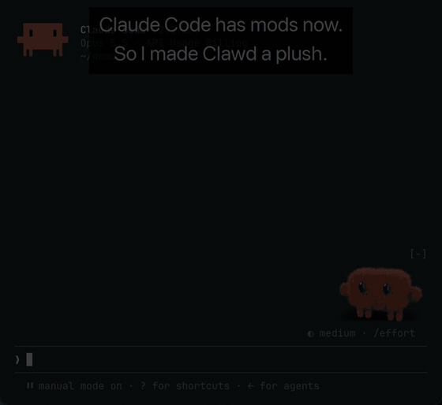

# plushie

<p align="center"></p>

A plush Clawd that lives above the Claude Code prompt and reacts to what
Claude is doing: idles and blinks, wiggles while a turn runs, holds a little
prop for each tool, wobbles when a tool fails or you interrupt, jumps after a
long turn, blushes when you say thanks, dozes off when left alone. Pat it,
or pick it up and move it.

It is a Claude Code mod: frames baked in Blender, played in the terminal by
swapping an `Image`'s source with `$.ui.blit`. Terminals with an image
protocol (Ghostty, kitty) only; elsewhere it stays out of the way.

An unofficial fan project, not affiliated with or endorsed by Anthropic.
Clawd and Claude Code are Anthropic's.

## Install

```
/plugin marketplace add xyc/plushie
/plugin install plushie@plushie
```

Needs Claude Code 2.1.287 or later with mods on. Mods are rolling out; if
`/plushie` isn't listed after installing, they aren't on for your account
yet.

To run it from a checkout instead:

```bash
claude --plugin-dir path/to/plushie
```

## Switches

Each is a switch, on by default, in `/config` or with `/plushie on|off <switch>`:

| Switch | What Clawd does |
| :-- | :-- |
| `drag` | drag it sideways along the band; it dangles while held, lands where you let go, and stays there next session |
| `pats` | click it without dragging: a squish, a happy squint, hearts |
| `toolProps` | holds a magnifier while reading, knitting needles while editing, a keyboard for the shell, binoculars on the web |
| `miniClawds` | a half-size Clawd per running subagent, walking off when it finishes |
| `stuffing` | grows rounder as the context window fills, deflates with a sigh on compaction |
| `blush` | blushes at thanks and praise in your prompt |
| `fidgets` | left alone, now and then looks around, scratches, yawns or hops |
| `sounds` | little sounds for pats, jumps, wobbles, blushes, being picked up and put down, deflating and dozing off |

## Commands

- `/plushie` hides or shows it.
- `/plushie <reaction>` plays one of Clawd's reactions: `happy`, `oops`,
  `pat`, `blush`, `sleepy`, `fidget-yawn`, `working-binoculars`,
  `idle-stuffed`, … (every folder in `assets/frames`).
- `/plushie list` shows every reaction, and every switch with its state.
- `/plushie on <switch>` / `/plushie off <switch>` flips a switch.

## Rebake the frames

```bash
blender/sheet.sh idle:0 happy:16          # contact sheet: build/sheet.png
/Applications/Blender.app/Contents/MacOS/Blender -b --factory-startup \
  -P blender/plush.py -- render build/layers [clip ...]
python3 blender/composite.py build/layers assets/frames [clip ...]
```

`blender/plush.py` holds the model, the fur, the props, the lights and
every clip's motion, and renders each frame twice: Clawd alone, and the
shadow alone. `blender/composite.py` lays one over the other into
`assets/frames` and writes the manifest the mod reads. The shadow's
strength and shape live in the compositor, so changing them is a re-run of
`composite.py`, not a render.

## Test

```bash
claude plugin test .
```

The tests drive every reaction through the real event that triggers it,
each with its switch on and off.

## License

MIT for the code, the Blender and sound scripts, and the frames and sounds
they make; see [LICENSE](LICENSE). The Clawd character and Claude Code are
Anthropic's, and the license doesn't cover them.
